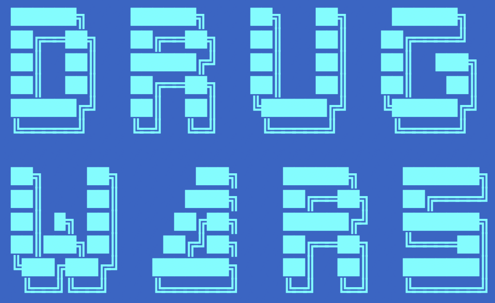

# Drugwars_rs

A rust-written terminal-based role-playing strategy game which is based on my memory of the classic DOS game from ages ago created by John E. Dell.



Date: 11 June 2025

[Oliver Bonham-Carter](https://www.oliverbonhamcarter.com/)

Email: obonhamcarter at allegheny.edu


# Table of Contents
- [Drugwars\_rs](#drugwars_rs)
- [Table of Contents](#table-of-contents)
  - [Description](#description)
  - [Features](#features)
  - [Setup](#setup)
  - [Gameplay](#gameplay)
    - [Controls (In Game)](#controls-in-game)
  - [Example Session](#example-session)
  - [Requirements](#requirements)
  - [License](#license)
  - [Contributing](#contributing)
    - [A Work In Progress](#a-work-in-progress)


## Description

Drugwars is a terminal-based role-playing strategy game inspired by the classic DOS game written by John E. Bell. In this version of the game, you play as a drug dealer in New York City who travels between boroughs, to buy and sell drugs. You also have to manage debt while you try to make as much cash as possible in 30 days. Be careful! The loan shark, other dealers and the cops are out to get you, in addition to other random events! Test your business smarts over the course of 30 days to survive, make cash, and pay off your debt. 

This game is written in Rust and features colorful terminal output for an engaging experience. It includes random news flashes that can affect drug prices, adding an element of unpredictability to your strategy.

## Features

- Travel between **Manhattan**, **The Bronx**, and **Brooklyn** (which are actually lovely places to visit in real life!)
- Buy and sell six types of drugs with fluctuating prices
- Manage your cash, debt, health, weapons, and trench coat space to carry drugs
- Randomly generated drug prices in each city
- Randomly generated events that can affect your cash flow
- Pay off your loan shark debt (with daily interest)
- Colorful terminal output for better readability
- **Shop Around**: Buy larger trench coats (for more inventory space) and weapons at random prices
- **Random News Flashes**: Funny, random events can cause sudden price spikes or drops for drugs

## Setup

1. **Clone the repository** (if you haven't already):

   ```zsh
   git clone git@github.com:developmentAC/drugwars_rs.git
   cd drugwars
   ```

2. **Build the project**:

   ```zsh
   cargo build --release
   ```

3. **Run the game**:

   ```zsh
   cargo run
   ```

## Gameplay

- You start with $2,000, 100 trenchcoat spaces, 0 weapons, and a $5,000 loan.
- Each day, you can buy, sell, travel, visit the loan shark to pay off debt, or **shop around** for upgrades.
- Drug prices change daily and are different in each city.
- **Random news flashes** may cause sudden, funny price changes for drugs.
- Traveling to a new city advances the day and applies loan interest.
- If your health drops to 0, your debt exceeds $10,000, or 30 days pass, the game ends.
- Your final score is based on your cash at the end of 30 days.

### Controls (In Game)

- `b` - Buy drugs
- `s` - Sell drugs
- `t` - Travel to another city
- `l` - Visit the loan shark to pay off debt
- `h` - Shop around for trench coat upgrades and weapons
- Enter the number corresponding to your drug/city/shop choice when prompted

## Example Session

```text
Welcome to Drugwars!

Day 1/30 in Manhattan
Cash: $2000
Debt: $5000
Health: 10/10
Weapons: 0
Trenchcoat space: 0/100
Inventory:
Current prices:
  Cocaine: $5000
  Heroin: $2000
  ...
Do you want to (b)uy, (s)ell, (t)ravel, visit the (l)oan shark, or (h) shop around?
```

## Requirements

- [Rust](https://www.rust-lang.org/tools/install)
- Works on macOS, Linux, and Windows (in a terminal that supports ANSI colors)
 - Note: I have not tested on Windows, but it should work in a terminal that supports ANSI colors.

## License


## Contributing

Contributions are welcome! If you have ideas for improvements or want to add more features, feel free to open an issue or submit a pull request.

### A Work In Progress

Check back often to see the evolution of the project! **DrugWars_rs** is a work-in-progress. Updates will come periodically.

If you would like to contribute to this project, please do! For instance, if you see some low-hanging fruit or tasks that could add value to the project, I would love to have your insight.

Otherwise, please create an issue for bugs or errors. Since I am a teaching faculty member at Allegheny College, I may not have all the time necessary to quickly fix bugs. I welcome the Open Source Community to further the development of this project. Much thanks in advance.

If you appreciate this project, please consider clicking the project's Star button. :-)
